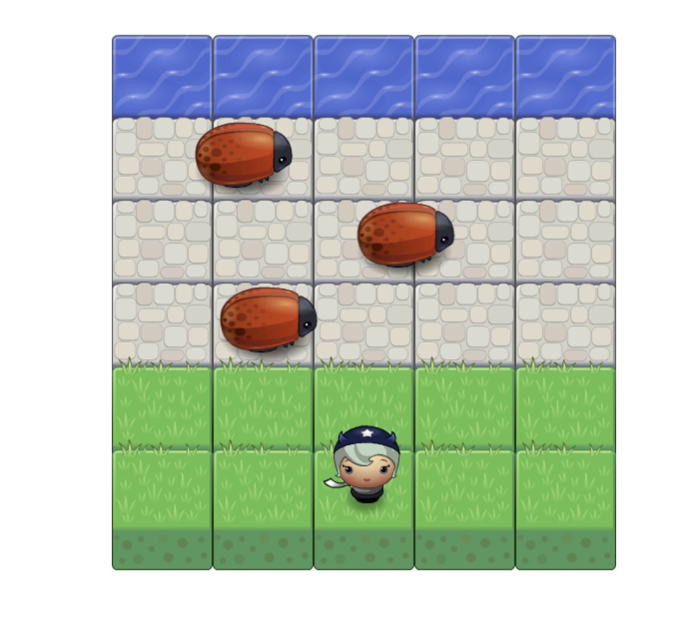

# frontend-nanodegree-arcade-game

A [classic arcade game](https://obayanju.github.io/arcade-game/) where you control a player to evade bugs and get to the end of the game.

## Motivation

This was built as a project of the Udacity Frontend Nanodegree to help practice my Javascript skills.

## How to Run?

- fork the repository
- clone the forked version of the respository with git clone `<link of repo>` on your terminal in the directory you want the game in. The link is found in the green clone or download button on github.
- open the game in browser of choice by copying and pasting the path

## How to Play?

- use direction keys up, left, down, and right to move the player
- The goal is to reach the stream without getting hit by bugs

## Screenshots

## Tech/framework used

- Vanilla Javascript
- HTML
- CSS
- [ESLint](https://eslint.org/)
- [SweetAlert](https://sweetalert.js.org/)
- [Prettier](https://prettier.io/)
- Git

## ToDo

- Implement score and star rating
- ability to collect gems to increase scores
- a leaderboard
- multiple players

## Credits

Thanks to Udacity for their awesome Front end Nanodegree
